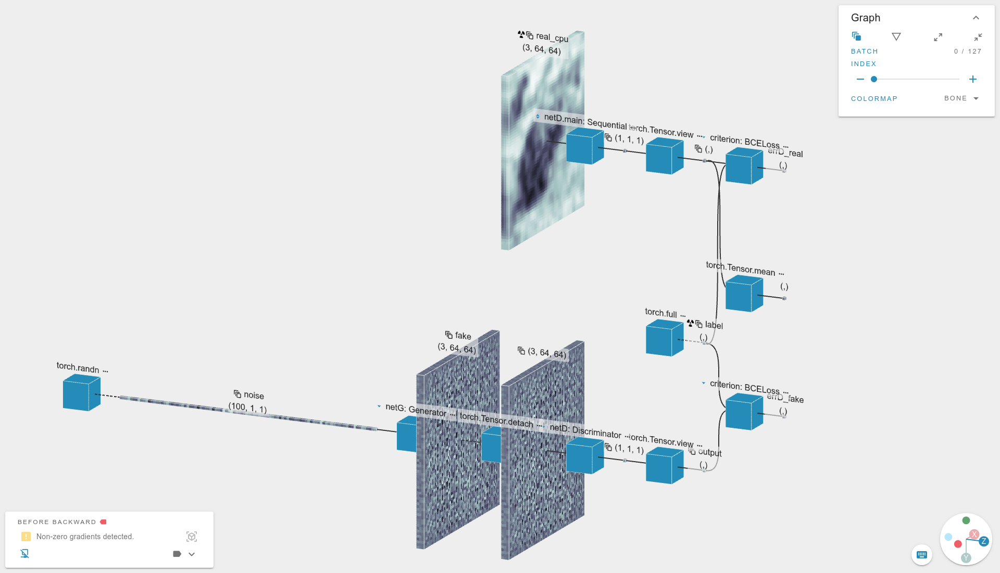

[](https://app.efemarai.com/view?id=)

This example is based on the PyTorch [DCGAN Tutorial](https://pytorch.org/tutorials/beginner/dcgan_faces_tutorial.html).

It highlights the generator and discriminator networks, how to build them and what loss is used to optimize the model.


## Starting

To run the code, download the dataset and execute

```
python dcgan.py
```

## Paper

[Unsupervised Representation Learning with Deep Convolutional Generative Adversarial Networks](https://arxiv.org/abs/1511.06434)
by Alec Radford, Luke Metz, Soumith Chintala
