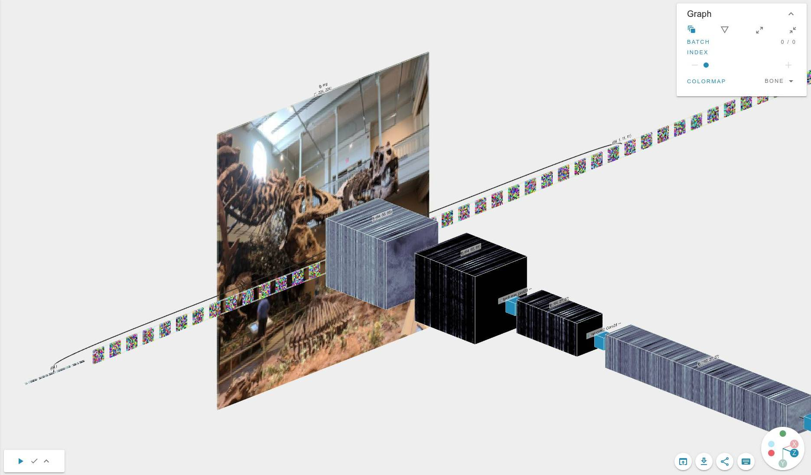

[](https://app.efemarai.com/view?id=regb7leYMRNhUQQD)

This example is based on the PyTorch [AlexNet](https://paperswithcode.com/method/alexnet) implementation.


## Starting

To run the code, execute

```
python alexnet.py
```

## Paper

[UImageNet Classification with Deep Convolutional Neural Networks](https://proceedings.neurips.cc/paper/2012/hash/c399862d3b9d6b76c8436e924a68c45b-Abstract.html)
by Alex Krizhevsky, Ilya Sutskever, Geoffrey E. Hinton