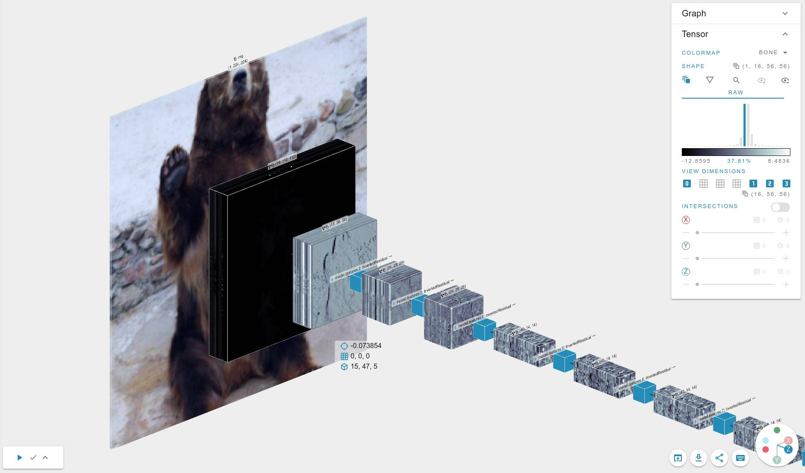

[](https://app.efemarai.com/view?id=XL4qPx9w7LAYsoHU)

This example is based on the [PyTorch Vision models](https://github.com/pytorch/vision).


## Starting

To run the code, execute

```
python torchvision_models.py --arch mobilenet_v3_small --image <dog.jpg>
```

If no image is specified, it will load an ImageFolder dataset at `data` folder.

Possible architectures are defined on the PyTorch Vision [models](https://pytorch.org/vision/stable/models.html) website.
