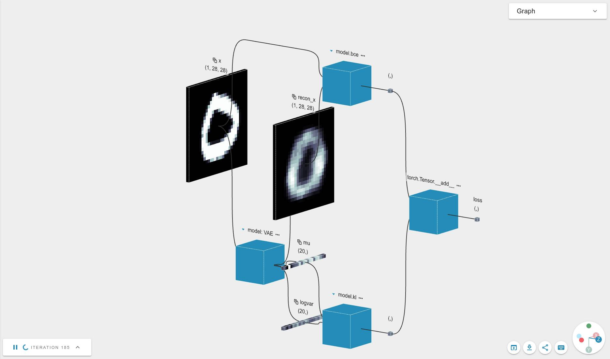

[](https://app.efemarai.com/view?id=nzHg3JxOxpuROjXO)

This example is a simple fully connected VAE model. It shows a training pipeline on the MNIST dataset.


## Starting

To run the code, execute

```
python mlpvae.py
```
