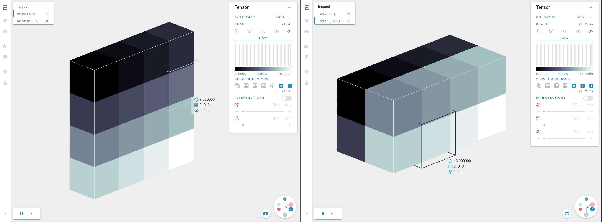

[](https://app.efemarai.com/view?id=)

Example tensor operations and visualizations with efemarai debugger. 

This is assosciated with the Medium post [Visual explanation of tensor operations](https://dani-angelov.medium.com/visual-explanation-of-tensor-operations-8311db654901).

## Starting

To run the code, just execute

```
python tensor_operations.py
```
